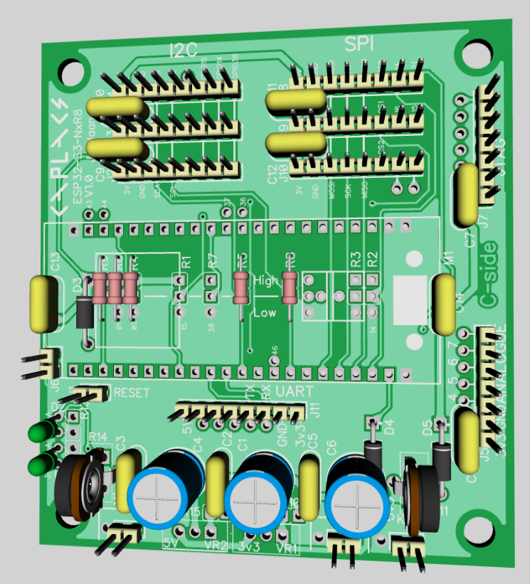

# ESP32-S3-Dev-Kit-NxR8 Kit Shield

This board acts as a carrier for the ESP32-S3-Dev-Kit-NxR8 Micro-Controller.
[waveshare]: https://www.waveshare.com/wiki/ESP32-S3-DEV-KIT-N8R8

**Make sure the pinouts of your ESP-32-S3 match the ones used here.**

The Printed Circuit Boards( PCBs) are designed using DipTrace.
A free DipTrace viewer is available to view the design files.

See the [DipTrace website][diptrace] for the viewer.
[diptrace]: https://diptrace.com/download/download-diptrace/

The goal is to have a fairly universal board for these micro-controllers that can be adapted to a variety of small projects.
There are no SMD component, all THP, with the goal to be easy to assemble at home.

The I2C and SPI interfaces should also align with the pinouts of other Micro-Controller shields I made - thus pheripherals can be used on either micro-controller shield.

#### Circuit Description
It consists of a Power Input with two adjustable voltage regulators to provide a 3V3 and 5V supply for use by the controller and pheripherals.
Although the Controller is only 3V3, the 5V Power Supply can be used on pheripherals - if they are 5V tolerant and their outputs can be brought down to 3V3 again.
There are a number of pheripheral connectors:
- 3 x I2C interfaces and 
- 3 x SPI interfaces.
- An ADC interface with 4 channels, that can also be used for other purposes if not ADC.
- The JTAG connector could also be used for other purposes.
- And a UART, also possible to re-purpose.

Additional pads allow rewiring/re-purposing of certain pins. 

With the ESP32 - IO pins can have a number of functions. Refer to the diagram for where these are connected and what could be done.

#### Assembly
The Micro-Controller is mounted on headers to make it easier for future replacements/repairs.
Almost all the components are mounted on the c-side including the Micro-Controller.
However most of the connectors for the SPI and I2C devices can be mounted on the other side - if that would be easier.
Refer to the Silkscreen text.

---
**3D View**
This is just a pre-view rendering with some old style components.

